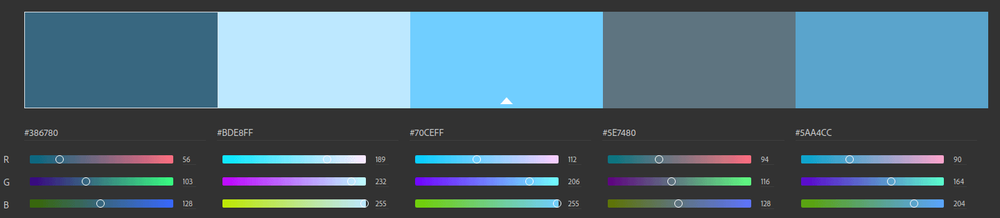

  

# breathe

> Feel better, every breathe matters

---

## Design

### Color palette

- `rgb(56, 103, 128)`
- `rgb(189, 232, 255)`
- `rgb(112, 206, 255)`
- `rgb(94, 116, 128)`
- `rgb(90, 164, 204)`

Colors from [Adobe color](https://color.adobe.com/create/)

### Logo

The logo icon is an adaptation of <a href="https://www.flaticon.com/free-icon/paint_1165817" title="Freepik">Freepik</a> on <a href="https://www.flaticon.com/" title="Flaticon"> www.flaticon.com</a> using the color palette above.
