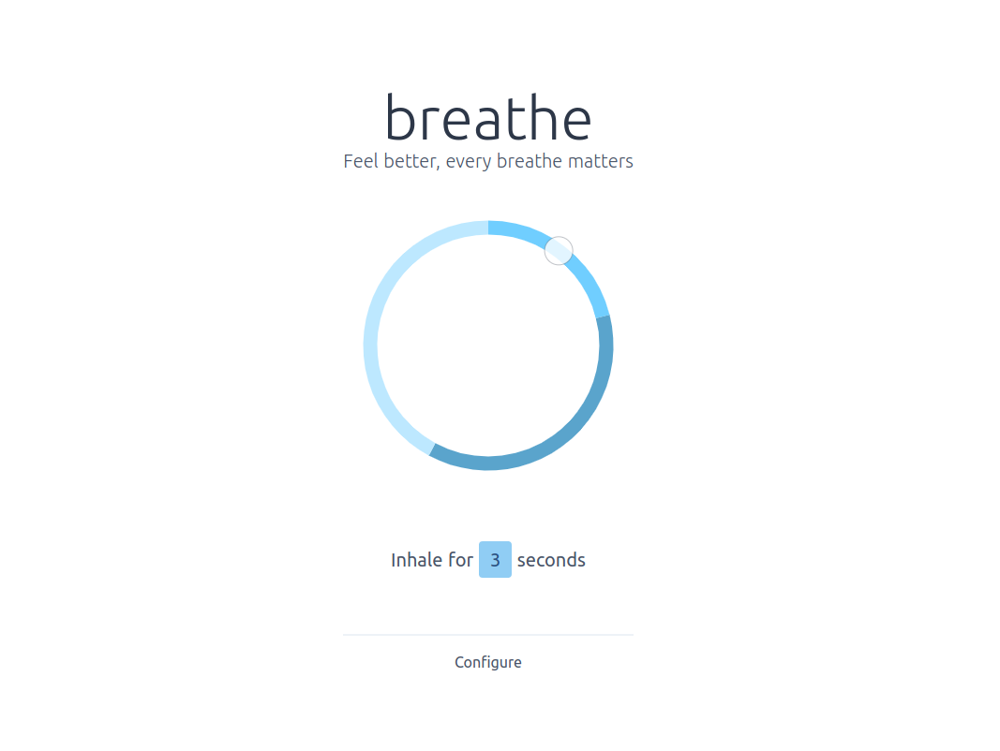

# breathe

> Feel better, every breathe matters

<small>You can see a live version at: https://breathe.luseeds.com</small>



## About

:warning: This is still a WIP project. Any help/contribution/PR is highly appreciated.

---

Our daily lives are full of a constant flow of information, thoughts, feelings.
We feel like time is flying away and we're not in control.

What if, for a short moment, we take control back.
This is where Breathe comes in.
Just settle down for a moment, relax and breathe!

Be in the present moment, that's all that matters.
Simply breathe.

## Build setup

For detailed explanation on how things work, check out [Nuxt.js docs](https://nuxtjs.org).

```bash
# install dependencies
$ npm install

# serve with hot reload at localhost:3000
$ npm run dev

# build for production and launch server
$ npm run build
$ npm run start

# generate static project
$ npm run generate
```

This website is hosted on [Netlify](https://netlify.com)

---

A project from [luseeds](https://luseeds.com)
